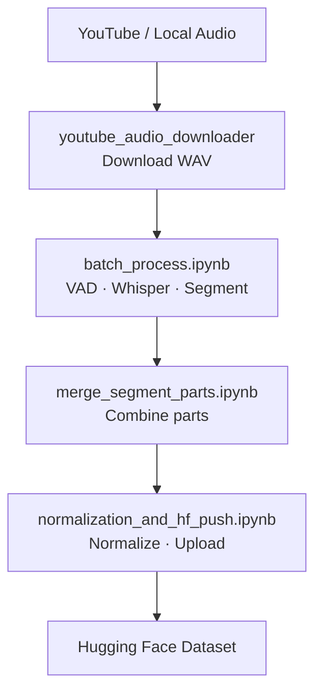

# TTS Dataset Pipeline

End-to-end pipeline for building a **single-speaker TTS training dataset**: download raw audio locally, process it on **Google Colab** (segmentation, transcription, normalization), merge parts, and publish to the **Hugging Face Hub**.

Designed for long-form speech (audiobooks, podcasts, playlists) at scale (100+ hours).

---

## Example

| | |
|---|---|
| **Input** | ▶️ [A JOKE by Anton Chekhov — FULL AudioBook](https://www.youtube.com/watch?v=hBsY6-xAj1o) (YouTube, CC BY) |
| **Output** | 🤗 [ulaspolat/tts-dataset-example](https://huggingface.co/datasets/ulaspolat/tts-dataset-example) on Hugging Face |

---

## Pipeline overview



| Step | Where | What happens |
|------|--------|----------------|
| 1 | Local | Download WAV files with `youtube_audio_downloader` |
| 2 | Google Drive | Upload raw audio under `PROJECT_DIR/data/partN` |
| 3 | Colab | **batch_process** — VAD + Whisper → short segments (`1.wav` / `1.txt`) |
| 4 | Colab | **merge_segment_parts** — combine parts into one renumbered folder |
| 5 | Colab | **normalization_and_hf_push** — clean text, resample audio, push to HF |

---

## Repository structure

```
tts-dataset-creation/
├── LICENSE
├── README.md
├── youtube_audio_downloader/          ← Step 1: local audio download
│   ├── download_single_audio.py
│   ├── download_playlist_audio.py
│   ├── audio_utils.py
│   ├── requirements.txt
│   └── README.md
├── notebooks/                   ← Step 2–5: Colab notebooks
│   ├── batch_process.ipynb
│   ├── merge_segment_parts.ipynb
│   └── normalization_and_hf_push.ipynb
```

---

## Requirements

### Local (downloader)

- Python 3.10+
- [FFmpeg](https://ffmpeg.org/download.html) on your PATH
- See [youtube_audio_downloader/README.md](youtube_audio_downloader/README.md)

### Colab (notebooks)

- **GPU runtime** (T4 minimum; A100 recommended for large batches)
- Google Drive with enough space for raw + segmented audio
- [Hugging Face account](https://huggingface.co/join) and access token (for the final upload step)

---

## Google Drive layout

Create a project folder under MyDrive and keep this structure:

```
/content/drive/MyDrive/project_name/
├── data/
│   ├── part1/              ← raw long WAV/MP3 files (batch run 1)
│   ├── part2/              ← raw files (batch run 2)
│   └── ...
├── segments/
│   ├── part1/              ← output: 1.wav, 1.txt, 2.wav, 2.txt, ...
│   ├── part2/
│   └── all_files/          ← merged dataset (after merge notebook)
└── backup/
    └── segments/
        └── all_files/      ← created by normalization (first run)
```

> **Note:** `youtube_audio_downloader` writes flat files to `./data` locally. On Drive, organize them into `data/part1`, `data/part2`, etc. before running the batch notebook.

---

## Quick start

### 1. Download audio (local)

```bash
cd youtube_audio_downloader
pip install -r requirements.txt
python download_playlist_audio.py "https://www.youtube.com/playlist?list=YOUR_PLAYLIST_ID"
```

Output: `./data/*.wav` (mono by default; sample rate configurable via `--sample-rate`).

**Only download content you have the right to use.**

### 2. Upload to Google Drive

Upload your WAV files to:

```
MyDrive/project_name/data/part1/
```

For additional batch runs, use `data/part2`, `data/part3`, etc.

### 3. Run Colab notebooks (in order)

Open each notebook from `notebooks/` in [Google Colab](https://colab.research.google.com/), set **Runtime → Change runtime type → GPU**, then run cells top to bottom.

#### `batch_process.ipynb`

Segments and transcribes long audio files.

**Configure in CELL2:**

```python
PROJECT_DIR = "/content/drive/MyDrive/project_name"   # edit path
INPUT_DIR = f"{PROJECT_DIR}/data/part1"               # raw audio for this run
OUTPUT_DIR = f"{PROJECT_DIR}/segments/part1"            # segmented output

WHISPER_LANGUAGE = "en"                            # ISO 639-1 (e.g. "en", "de", "fr", "tr")
```

- Run once per part (`part1`, `part2`, …) — update both `INPUT_DIR` and `OUTPUT_DIR` each time.
- Supports **resume**: re-running skips already processed segments.

#### `merge_segment_parts.ipynb`

Merges `segments/part1`, `part2`, … into a single renumbered folder.

**Configure in CELL3:**

```python
PROJECT_DIR = "/content/drive/MyDrive/project_name"   # same as batch notebook
SOURCE_DIRS = ["part1", "part2", "part3"]          # parts you processed
TARGET_DIR = "all_files"
```

Original part folders are **not** deleted — only copied.

#### `normalization_and_hf_push.ipynb`

1. **Normalizes** transcript text in-place on Drive (subtitle removal, number-to-words, etc.)
2. **Builds** a Hugging Face dataset (resampled, loudness-normalized audio)
3. **Uploads** to the Hub

**Configure in CELL3 (normalization):**

```python
PROJECT_DIR = "/content/drive/MyDrive/project_name/segments"   # edit path
AUDIO_DIR = f"{PROJECT_DIR}/all_files"
BACKUP_DIR = f"{PROJECT_DIR}/backup/segments/all_files"
NORMALIZE_LANG = "en"                              # num2words language
```

**Configure in CELL9 (Hugging Face):**

```python
HF_USERNAME = ""              # your HuggingFace username
HF_TOKEN = ""                 # hf_... token — never commit this
OUTPUT_DATASET_NAME = ""      # dataset repo name on the Hub
PROJECT_DIR = "/content/drive/MyDrive/project_name"
AUDIO_SOURCE_MODE = "all_files"
```

Get a token at [huggingface.co/settings/tokens](https://huggingface.co/settings/tokens).

The HF processing step uses **checkpoints** — if Colab disconnects, re-run from the processing cell and it resumes.

---

## Models & language support

| Component | Model | Notes |
|-----------|-------|-------|
| Voice activity detection | [Silero VAD](https://github.com/snakers4/silero-vad) | Language-agnostic |
| Speech transcription | [faster-whisper](https://github.com/SYSTRAN/faster-whisper) `large-v3` | 99 languages via ISO 639-1 code |
| Number-to-words normalization | [num2words](https://github.com/savoirfairelinux/num2words) | 50+ languages |
| Audio resampling & loudness | torchaudio + EBU R128 | Target: 24 kHz, −23 LUFS |

Whisper `large-v3` supports 99 languages out of the box — set `WHISPER_LANGUAGE` to any [ISO 639-1 code](https://en.wikipedia.org/wiki/List_of_ISO_639-1_codes) (e.g. `"en"`, `"de"`, `"fr"`, `"tr"`, `"zh"`, `"ja"`). Match `NORMALIZE_LANG` in the normalization notebook to the same language for correct number-to-words conversion.

---

## Changing language

| Component | Notebook | Setting |
|-----------|----------|---------|
| Speech transcription (Whisper) | `batch_process.ipynb` | `WHISPER_LANGUAGE` in **CELL2** |
| Number-to-words normalization | `normalization_and_hf_push.ipynb` | `NORMALIZE_LANG` in **CELL3** |

Subtitle detection regex in the normalization notebook is tuned for Turkish credits (`altyazı …`). Adjust `SUBTITLE_PATTERN` in **CELL5** if you use another language.

---

## Output format

After the full pipeline, the Hugging Face dataset contains:

| Column | Description |
|--------|-------------|
| `text` | Normalized transcript |
| `audio` | Mono WAV, loudness-normalized |

---

## License

This project is licensed under the MIT License — see [LICENSE](LICENSE) for details.

Use this pipeline responsibly. You are responsible for complying with copyright and platform terms when downloading and publishing audio data.
